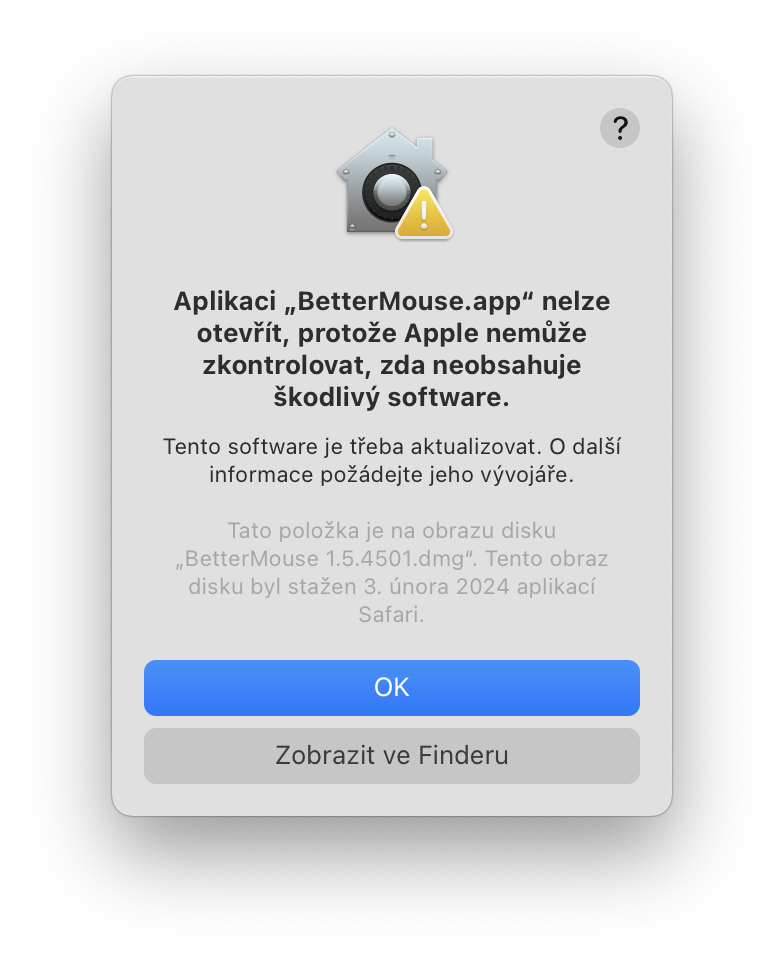
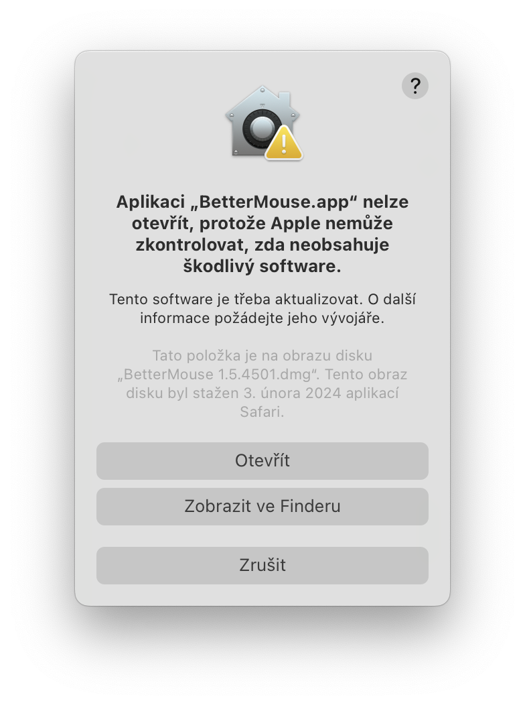
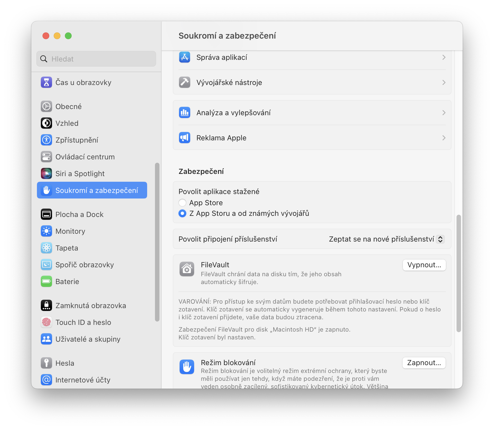

# Windows to MAC pain transition

## Devices

[Hub](https://eu.ugreen.com/products/ugreen-usb-c-7-in-1-hub-with-4k-60hz-hdmi?variant=46973588078940)

 - Support for HDMI 4k 60hz

[Mouse](https://www.logitech.com/cs-cz/products/mice/mx-master-3s.910-006559.html)

 - Use the one for Windows (it comes with additional USB receiver)
 - Do not buy Apple Magic Mouse - it sucks, save your carpal tunel!

## Tips & Tricks

### Apple watch

 - If you wear them, your macbook will automatically unlock

### USB disk formatting

 - macos does not suppor writing to NTFS formating
 - for cross platform support is best to use exFAT or FAT32 (I personally have two partitions with different formating on my UBS drive)
 - Advice: buy flash drive with USB A and C together, like this [one](https://www.alza.cz/sandisk-ultra-dual-drive-luxe-256gb-d5838635.htm)

### Enter click in finder

 - Won't open the file but rename it

### Drag and Drop files

 - Drag it -> `CMD + TAB` -> Drop it

### File preview

 - Press `spacebar` 

### Forget mouse

 - Try to learn macos shortcuts
	 - Quit app `CMD + Q` Some apps will quit when you click the red x and some wont't. This shortcut will ensure that it always quits
	 - Close window `CMD + W` 
	 - New tab `CMD + T` 
	 - Copy `CMD + C` First you select the file and then when you decide if you want to move or copy it. `CMD + X` works in most applications but not in finder
	 - Paste `CMD + V` 
	 - Move `CMD + OPT + V` 
	 - Spotlight `CMD + spacebar`
	 - Screenshot `SHIFT + CMD + 4` Default save location is Desktop. Save to clipboard `SHIFT + CMD + CTRL + 4` More [here](https://support.apple.com/en-us/102646)

### Open downloaded apps

Usually when you try to open a downloaded application, you will get a pop-up saying that the developer cannot be verified. This is solved by opening it once or twice with a two-finger click or right-click.

### Install apps

 - Applications are usually installed by moving the `.app` to the Applications folder 
 - Maybe you need firt enable instaltion 3rd party apps (outside of appstore)

 
### Uninstall apps

 - Move it from Applications folder to Trash, that's all

### Appstore apps

All apps distributed through the Mac App Store are sandboxed (it's a requirement). Sandboxing severely limits what an app can do on your Mac. This is usually a good thing as it helps prevent malware and viruses from taking over your Mac or stealing your information.

Unfortunately, sandboxing also means that certain actions/tasks can't be completed by the sandboxed app. Getting a list of every app and process running on your Mac is something a sandboxed app can't do.

### Keep in mind

 - Apple silicon macs are ARM based, which means x86 apps will run under Rosetta 2 emulation.

### macbook restart or shutdown

 - No needed

### Wait before upgrade to new macos

 - Wait a bit before upgrade, save yourself the headache and wait until your apps are ready for the new version
 
### Safari

 - Safari is perfect for battery life but some sites don't work or don't load properly on it

### ApplePay

 - ApplePay only works on safari

### Awesome macOS open source applications

 - Many useful apps are liste here [look at this list](https://github.com/serhii-londar/open-source-mac-os-apps)

### Macos scaling

 - Macos is not designed to scale 1:1 like Windows, which is why it looks so hideous on external monitors but perfectly fine on macbooks
 - [Explanation](https://github.com/waydabber/BetterDisplay/wiki/MacOS-scaling,-HiDPI,-LoDPI-explanation)

### Keyboard mess

 - Delete is done by `CMD + BACKSPACE`
 - Custom keyboard headache: [How to Switch the Control and Command Keys](https://www.macinstruct.com/tutorials/how-to-switch-the-control-and-command-keys/)
 - @#$~^&*{} is on top

### Screen audio capture

 - Macos can't natively record screen audio
 - Workaround is to use this app [Background Music](https://github.com/kyleneideck/BackgroundMusic)

### Virtual machine

 - Open source but unusable [UTM](https://github.com/utmapp/UTM)
 - Pricey but best [Parallels Desktop](https://www.parallels.com/products/desktop/)
	 - Official support for Windows on ARM

## Useful apps

### [Homebrew](https://brew.sh/)

 - The Missing Package Manager for macOS (or Linux)
 - With this, you can easily install the apps below

### [Rectangle](https://github.com/rxhanson/Rectangle)

 - Rectangle is a window management app based on Spectacle, written in Swift.

### [AltTab](https://github.com/lwouis/alt-tab-macos)

 - AltTab brings the power of Windows alt-tab to macOS
 - macos by default `CMD + TAB` show opened apps, not windows

### [Mac Mouse Fix](https://github.com/noah-nuebling/mac-mouse-fix)

 - Mac Mouse Fix is an app that makes your mouse better.
 - Fix scroll wheel direction
 - v2 is still free

### [LinearMouse](https://github.com/linearmouse/linearmouse)

 - If you don't like mouse acceleration

### [MiddleClick](https://github.com/artginzburg/MiddleClick-Sonoma)

 - Emulate a scroll wheel click with three finger Click or Tap on MacBook trackpad and Magic Mouse

### [The Unarchiver](https://theunarchiver.com/)

 - The Unarchiver is the only app you need to open RAR on Mac

### [BetterDisplay](https://github.com/waydabber/BetterDisplay)

 - It lets you convert your displays to fully scalable screens, manage display configuration overrides, allows brightness and color control

### [MonitorControl](https://github.com/MonitorControl/MonitorControl)

 - Controls your external display brightness and volume and shows native OSD. Use menubar extra sliders or the keyboard, including native Apple keys!

### [KeepingYouAwake](https://github.com/newmarcel/KeepingYouAwake)

 - prevent your Mac from entering sleep mode for a predefined duration or as long as it is activated.

### [Amphetamine](https://apps.apple.com/us/app/amphetamine/id937984704?mt=12)

 - Similar to KeepYouAwake

### [AlDente](https://apphousekitchen.com/)

 - The ALL-IN-ONE charge Limiter App for MacBooks

### [Aerial](https://github.com/JohnCoates/Aerial)

 - Aerial is a Mac screensaver (macOS 10.12 or later) based on the new Apple TV screensaver that displays the Aerial movies Apple shot over New York, San Francisco, Hawaii, China, etc.

### [Hidden Bar](https://github.com/dwarvesf/hidden)

 - Hidden Bar lets you hide menu bar items to give your Mac a cleaner look.

### [NOIR](https://getnoir.app/)

 - Dark mode for safari

### [Font Smoothing Adjuster](https://github.com/bouncetechnologies/Font-Smoothing-Adjuster)

 - Re-enable the font smoothing controls removed in macOS Big Sur

### [Alfred](https://www.alfredapp.com/)

 - Alfred is an award-winning app for macOS which boosts your efficiency with hotkeys, keywords, text expansion and more. Search your Mac and the web, and be more productive with custom actions to control your Mac.
 - It has build in clipboard history

### [Raycast](https://www.raycast.com/)

 - Raycast is a blazingly fast, totally extendable launcher. It lets you complete tasks, calculate, share common links, and much more.
 - Alfred alternative

### [IINA](https://github.com/iina/iina)

 - IINA is the **modern** video player for macOS.
 - IINA > VLC

### [OrbStack](https://github.com/orbstack/orbstack)

 - Is the fast, light, and easy way to run **Docker** containers and Linux machines on macOS
 - It's a supercharged WSL and Docker Desktop alternative, all in one easy-to-use app.

### [Brave](https://github.com/brave/brave-browser)

 - Chromium based web browser with build-in adblocker

### [Min](https://github.com/minbrowser/min)

 - Min is a fast, minimal browser that protects your privacy. It includes an interface designed to minimize distractions

### [Arc](https://arc.net/)

 - Arc is the Chrome replacement I’ve been waiting for

### [OBS](https://github.com/obsproject/obs-studio)

 - OBS Studio is software designed for capturing, compositing, encoding, recording, and streaming video content, efficiently.

### [Drawio](https://github.com/jgraph/drawio-desktop)

 - Drawio-desktop is a diagramming and whiteboarding desktop app based on [Electron](https://electronjs.org/) that wraps the [core draw.io editor](https://github.com/jgraph/drawio).

### [Etcher](https://etcher.balena.io/)

 - Flash OS images to SD cards & USB drives, safely and easily.

### [Sideloadly](https://sideloadly.io/)

 - The new & best way to sideload your favorite games and apps to your iOS device, Apple Silicon Mac or Apple TV!

### [qBittorrent](https://github.com/qbittorrent/qBittorrent)

 - qBittorrent is a bittorrent client programmed in C++ / Qt that uses libtorrent (sometimes called libtorrent-rasterbar) by Arvid Norberg.

### [Transmission](https://github.com/transmission/transmission)

 - Transmission is a fast, easy, and free BitTorrent client
 - qBitttorrent alternative

## Others

 - Cork - homebrew GUI
 - Dropzone - drop file to menu bar
 - Visual Studio Code
 - Karabiner - A powerful and stable keyboard customizer for macOS
 - RDP - Microsoft Remote Desktop
 - MultiPresenter
 - CleanMyMac X - paid macos cleaner
 - OnyX - free cleaner for macos
 - Stats - macOS system monitor in your menu bar
 - TeamViewer
 - iTerm2 - replacement for Terminal
 - Xcode - IDE for apple platform

## Note

> Version of this document: 0.2